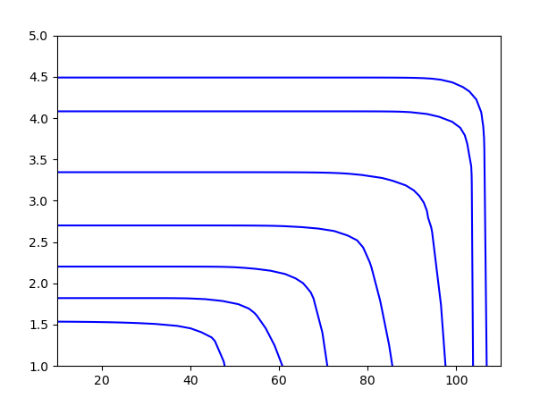

---
presentation:
  theme: black.css
  enableSpeakerNotes: true
  mouseWheel: true
---

<!-- slide -->
# 汇报 08-06
1. 补全压气机图谱
2. 发现更多的增压器性能评估方法
3. 气阀部分
4. 中冷器部分

<!-- slide -->
## 1. 补全压气机图谱
- 通过pyhton，将压气机图谱补全

<!-- slide vertical=true-->
## 新的问题
- 但具体到模型该怎么应用呢
- 示例模型的参数已经真机的参数么

<!-- slide -->
# 2. 发现更多的增压器性能评估方法
- 排气最大可用能量（高等内燃机）
- 排气压力波中包含的可用能量
- 排气能量传递效率

<!-- slide -->
# 3. 气阀部分
- 经过研究，发现很难从示例图像中，估算本机升程
- 发现新的计算进排气流量方法（高等内燃机）

<!-- slide -->
# 4. 中冷器部分
- 并未发现新的中冷器模型，目前模型即为最通用的
- 新增出口压力的计算