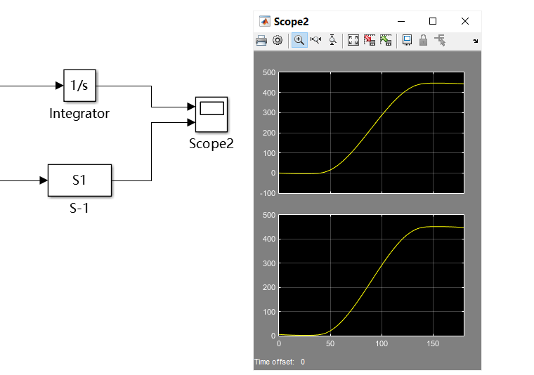
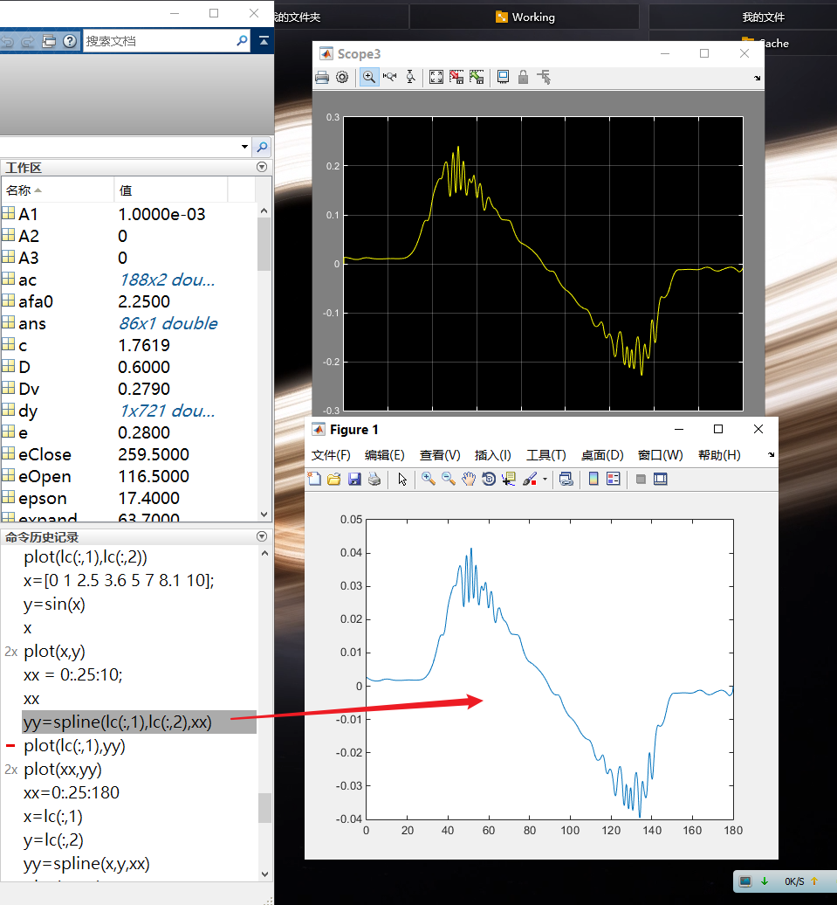

# 汇报 20- 05- 20

## 对波形调整的尝试

- 尝试使用s函数进行对波形进行调整，来消除代数环方面的影响，但目前只会使用积分…并不会把二次微分的方程写进s函数

  在图中可以看出…我写的S函数，在积分这方面倒还挺符合自带的积分模块的……（不过没有0以下的数据）

  

- 在此过程中发现，方程的x 和 dx 在单独微分的时候也会有很大的波动，可能问题出现在这里

  - 不过我本来就是使用分离的x 和 dx，已经尽可能减少对高阶数据的失真，那我该怎么去获取范例论文中的数据…

- 尝试使用了三次样条插值，spline函数，但是结果并没有什么不同，反而波形的峰值还变小了（本来应在0.15附近，经过插值后再求导，就变成0.03左右的样子了）

