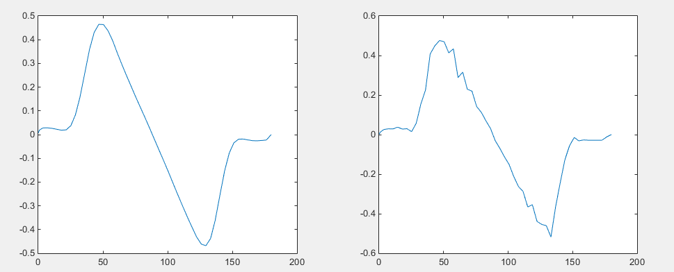
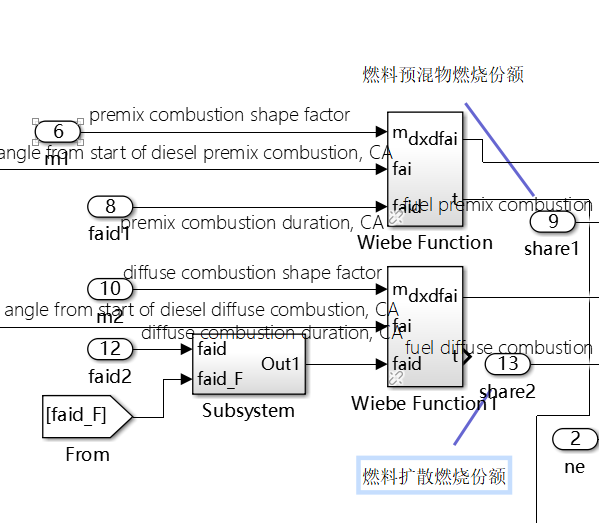

# 汇报 20- 06 -03

## 1. 气门升程的优化

### 1.  优化凸轮升程曲线

经过对曲线拟合工具箱的学习，可以把升程曲线的导数变得更加平滑：

​	此处并未采用ployfit（多项式拟合），多项式拟合时，18次以上时，曲线才会大致贴合，但仍有较大误差

​	此处采用`Smoothing Spline`，指示参数选为0.012时，能较大程度兼顾平滑和精度。

​	

​	<u>凸轮升程曲线</u>（蓝点为原曲线，红线为拟合后的曲线）

​	<u>凸轮升程的导数曲线</u>（左为拟合后曲线的导数，右为原曲线的导数）

### 2. 优化气门升程曲线

​	使用该拟合后的曲线，结果图像更加平滑，与参考文献中的结果差别较小，可以看出此数学模型还是可靠的，只是输入的参数精度不够。

### 3. 仍存在的问题：

​	可以看出加速度曲线失真较为严重，经过排查，发现是 凸轮速度曲线 精度不够（采用波动更大的该曲线，会导致结果抖动加剧，因此判断出来是该曲线的问题），原因如下

## 2. 漏气工况的模拟

按照参考论文中的公式，对老师搭建的双韦博模型进行修改

其中：

为故障工况下的燃烧放热率；

为燃烧连续角修正系数——缸内压力/燃烧不完全；

为燃烧修正系数——雾化不良/燃烧不完全；

为循环喷射体积修正系数——雾化不良/燃烧不完全；

为故障工况下缸内燃料燃烧释放的热量；

是==汽缸内的气体质量系数==——泄漏/工质减少。

### 1. 遇到的问题

#### 韦博模型的选择

​	参考论文中，是按照单韦博模型修改的，而在双韦博模型中，应该对扩散燃烧动手还是对预混合燃烧动手？（图为修改 扩散燃烧连续角）

#### 放热量的计算

在参考论文中，$\frac{dQ_{Bf}}{d\varphi}$是通过以下公式得出的：

$$
\frac{dQ_{Bf}}{d\varphi}=\frac{d\chi_{gu}}{d\varphi}\ast H_u\ast\eta_u\ast g_f*g_ff
$$

其中，$g_f$为每循环喷油量

但是在王海燕论文中，介绍双韦博模型的部分，只给出了计算到$\frac{d\chi}{d\varphi}$的部分，而老师给的模型中是通过以下公式计算的：

$$
dQ=d\chi*m_f*h_u*c
$$

 其中，$mf$同为每循环喷油量，猜测 c 所指的即是燃烧效率，模型中给出的计算方法如下：

c 的值在燃气模式下为1，燃油模式下与 t 相关

t 表示为，预混合燃烧的程度，计算方式如下
$$
\left\{ \begin{array} { c } { \frac { c _ { a } - \varphi _ { z } } { \varphi _ { d } } > 1 , t = 1 } \\ { \frac { c _ { a } - \varphi _ { z } } { \varphi _ { d } } < 1 , t = \frac { c _ { a } - \varphi _ { z } } { \varphi _ { d } } } \end{array} \right.
$$
然后跟了一个七阶的拟合函数

所以这个参数 c 具体是如何计算的呢，燃气工况中是否有另外的计算方法

## 双燃料模型依然无法运行。。。无法进行校验

