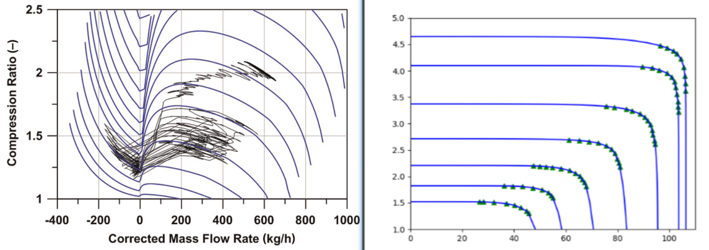

---
presentation:
  theme: sky.css
  mouseWheel: true

---
<!-- slide -->
# 汇报概要
###  进排气阀
### 增压器调试
### 压气机图谱
### python
<!-- slide data-transition="convex" -->
## 1. 进排气阀部分
#### 分析了气门间隙0.28和0.32时，气门各个参数的状态

<!-- slide vertical=true-->
 - 此处为进排气阀——凸轮行程/速度

<!-- slide vertical=true-->
- 此处为进排气阀——阀门的行程/速度/加速度

<!-- slide vertical=true-->
- 此处为进排气阀——可流通面积

<!-- slide data-transition="convex" -->
## 2. 增压器调试部分

目前增压器部分让然存在问题

运行起来会导致0除崩溃

<!-- slide vertical=true-->

直接原因应该是压气机的增压比慢慢会变为赋值

<image class="fragment fade-up" src='image/image-20201009095504250.png'>

<!-- slide vertical=true-->

经过排查，应该是压气机的扭矩计算出了问题

<image class="fragment fade-up" src='image/image-20201009095715142.png'>
<!-- slide data-transition="convex" -->

## 3. 压气机图谱

这是我用python补全的压气机图谱

<image class="fragment fade-up" src='image/image-20201009101754724.png'>

<!-- slide vertical=true-->

前两天老师给我发了一个论文中使用的压气机图谱

<image class="fragment fade-up" src='image/image-20201009101823720.png'>
<!-- slide vertical=true-->

<!-- slide vertical=true-->

经过调试...

我发现目前很难通过python自动生成斜率的方法，完成对该型图谱的补全

应该会采用描点+高阶曲线拟合的方法对每条线进行处理

只是这样再复现起来就很麻烦，帮不到后来者了

<!-- slide vertical=true-->

同时，新的问题是，一个压力比和转速，对应两个流量

是否采用该型图谱，需要新的建模方法

<image class="fragment fade-up" src='image/image-20201009101823720.png'>
<!-- slide data-transition="convex" -->

## 4. python部分
 

最近在学习 入党积极分子 的知识

但是吧...

只能在电脑上，在特定的网站上做题，就很不开心

我想把它做成本地的文档，这样无论是按着自己喜好归类、笔记，还是拿到手机上观看、甚至用手机朗读也更方便

<!-- slide vertical=true-->

这是网站上的题目（单选题、多选题）

<image class="fragment fade-up" src='image/image-20201008223222906.png'>
<!-- slide vertical=true-->

这是网站上的题目（判断题、填空题）

<image class="fragment fade-up" src='image/image-20201008223414167.png'>
<!-- slide vertical=true-->

把它们直接连着题干、选项、答案复制下来，保存为纯文本的txt格式就行

<image class="fragment fade-up" src='image/image-20201008223654260.png'>
<!-- slide vertical=true-->

再使用python把它处理为markdown格式，下面为python代码

<image class="fragment fade-up" src='image/image-20201008223931626.png'>
<!-- slide vertical=true-->
### 能力介绍：
 
<li style="text-align:left"class="fragment fade-up">自动搜索单选题、填空题答案，并填到正确位置，加上高亮</li>
<li style="text-align:left"class="fragment fade-up">自动搜索多选题的所有正确答案，并组合起来放入题干，并在后面添加废弃选项，同时加上删除线效果</li>
<li style="text-align:left"class="fragment fade-up">自动搜索判断题的答案，把对/错放在题干后面并高亮</li>
<!-- slide vertical=true-->

### 效果如下：
<image class="fragment fade-up" src='image/image-20201008224619862.png'>
<!-- slide vertical=true-->
### one more thing：

由于记录知识点的时候，是按卷子的顺序来的

所以题目分类就比较的混乱

所以小彩蛋就是 可以按照特定规则，对各类题目进行分类

这样生成的文档就比较方便记忆啦

<!-- slide vertical=true-->
### one more thing + ：

这是手机上朗读的样子，带来无与伦比的催眠体验

<image class="fragment fade-up" src='image/image-20201008225335783.png'>

